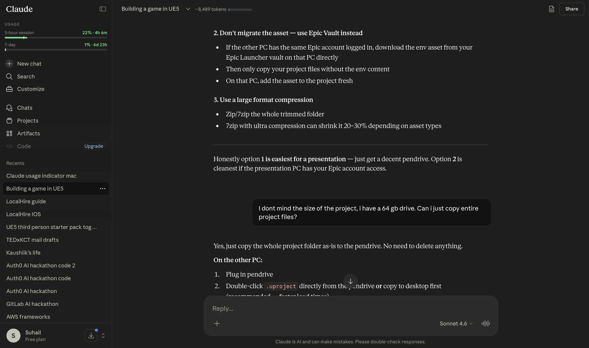

# Claude Limit Indicator – Safari

A Safari extension for macOS that shows your Claude.ai usage limits 
directly in the sidebar.




## Features
- Session (5-hour) and weekly (7-day) usage bars
- Color coded: 🟢 green → 🟡 yellow at 60% → 🔴 red at 80%
- Works for all account types (free and paid)
- Hides automatically when sidebar is collapsed
- No data stored, no external requests

## Installation

Requires Xcode on macOS. No Apple Developer account needed.

1. Clone this repo
2. Open Terminal in the project folder and run:
```bash
   xcrun safari-web-extension-converter /path/to/safari-extension
```
3. Open the generated `.xcodeproj` in Xcode → press ⌘R
4. Go to Safari → Settings → Extensions → enable **Claude Limit Indicator**
5. Go to Safari → Develop → Allow Unsigned Extensions

> You'll need to re-enable "Allow Unsigned Extensions" each time you restart your Mac.

